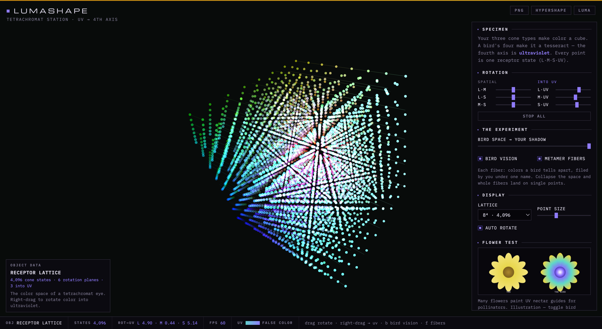
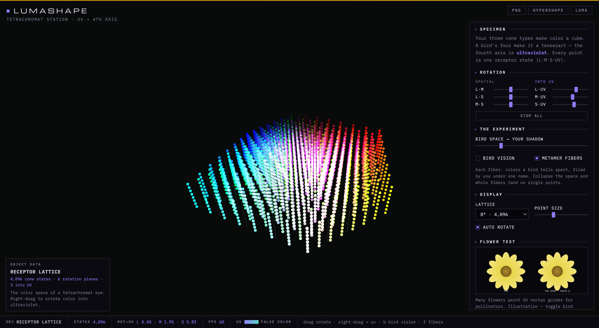

<div align="center">

# LUMASHAPE

### the bird's fourth primary

**[Open it live](https://mowke.github.io/LUMASHAPE/)** · zero dependencies · pure WebGL2

the crossover of [HYPERSHAPE](https://github.com/MowkE/HYPERSHAPE) × [LUMA](https://github.com/MowkE/LUMA)

[](https://mowke.github.io/LUMASHAPE/)

</div>

Your eye has three cone types, so your color space is a cube. LUMA showed it to you. A bird has a **fourth cone type, tuned to ultraviolet**, so a bird's color space is a **tesseract**, and rotating tesseracts is what HYPERSHAPE was built for. LUMASHAPE is where the two projects meet: the four-dimensional color space of a bird, rendered as a rotatable 4D lattice of receptor states, with the UV axis as the dimension you are missing.

This is not a metaphor. Tetrachromatic color vision is genuinely four-dimensional; avian vision science plots it in tetrahedral color spaces for exactly this reason. Every point in the chamber is one receptor state `(L, M, S, UV)`. The first three axes are the cube you live in.

## What you can do

- **Rotate into UV.** Right-drag, or drive the three `·UV` rotation planes. Three of the tesseract's six rotation planes stay inside your cube; the other three trade visible color for ultraviolet.
- **See like a bird** (`B`). UV content gets a shimmering false color, because the honest truth is that no real color can stand in for it. UV-rich points glow the way UV-marked flowers do to a jay.
- **Collapse the space.** Drag "bird space → your shadow" and watch the tesseract flatten into the human cube. Colors a bird tells apart pile onto single points. That is metamerism, live.
- **Metamer fibers** (`F`). Each glowing line is a family of bird-distinguishable colors that you file under one name. One human color equals a whole line of bird colors.
- **The flower test.** Many flowers paint UV nectar guides for their pollinators. The same procedural flower through your eyes and through a bird's.

| | |
|:---:|:---:|
| [](https://mowke.github.io/LUMASHAPE/) | [](https://mowke.github.io/LUMASHAPE/) |
| **Bird vision, metamer fibers threading the lattice** | **The collapse: 4D bird space flattening into your 3D shadow** |

## Run it

Live at **[mowke.github.io/LUMASHAPE](https://mowke.github.io/LUMASHAPE/)**, or locally:

```bash
python3 -m http.server 8000
# → http://localhost:8000
```

No frameworks, no build step. Drag orbits, right-drag rotates into UV, `B` bird vision, `F` fibers, `space` pauses, `S` saves a PNG.

## Honesty notes

The lattice shows receptor *states*, colored by an approximate human rendering of their L/M/S part. Real bird cone sensitivities overlap and differ by species, and the UV false color is a deliberate fiction; that is the point. The flower is a procedural illustration of typical nectar-guide patterns, not a photograph.

## The trilogy

1. **[HYPERSHAPE](https://mowke.github.io/HYPERSHAPE/)**: dimensions of space. Rotate 4D geometry, with w as color.
2. **[LUMA](https://mowke.github.io/LUMA/)**: dimensions of color. Six experiments on the gap between color models and eyes.
3. **[LUMASHAPE](https://mowke.github.io/LUMASHAPE/)**: both at once. A real 4D color space, where the 4th dimension is a color you will never see.

Built by [Samahith Thellakal](https://github.com/MowkE). MIT licensed.
